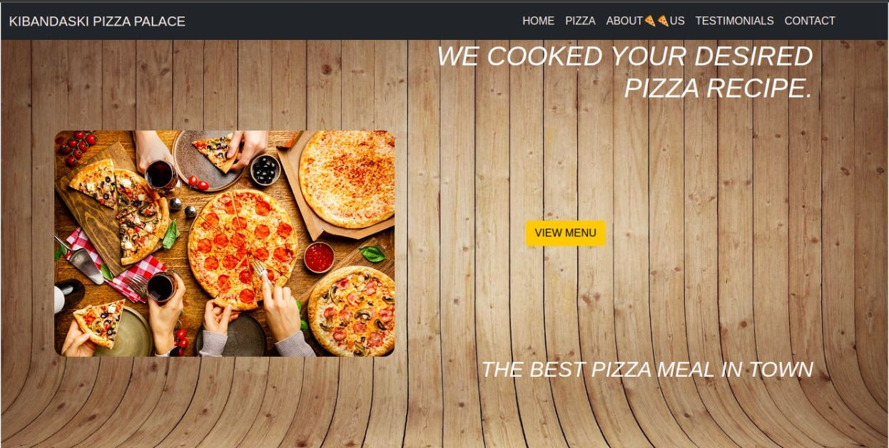
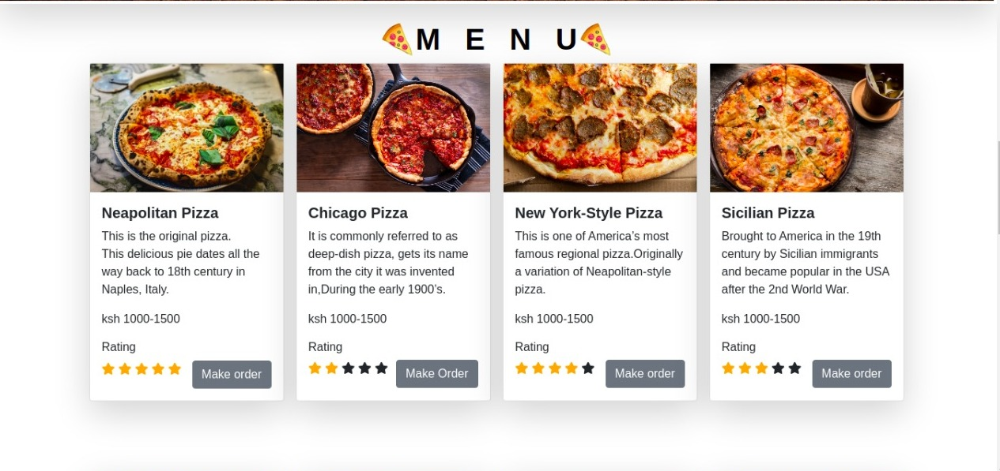
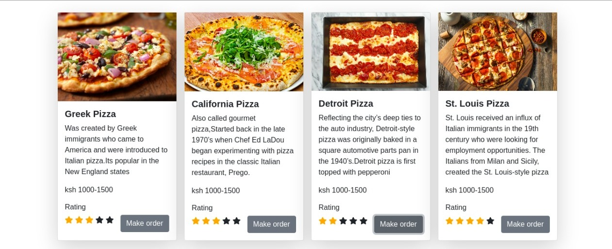
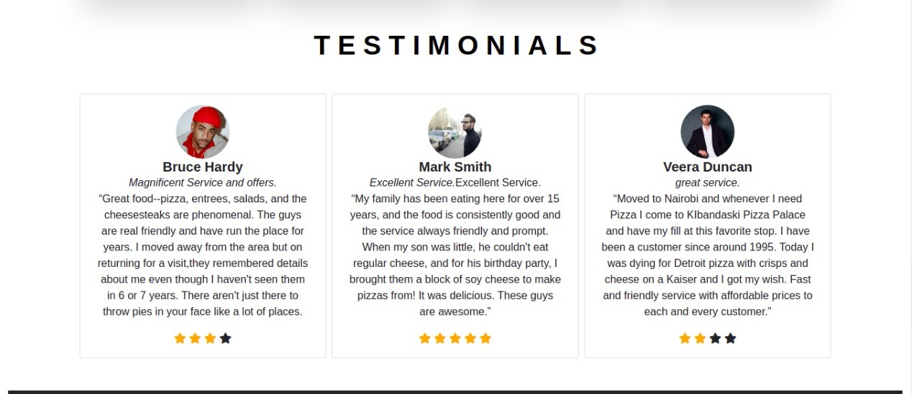
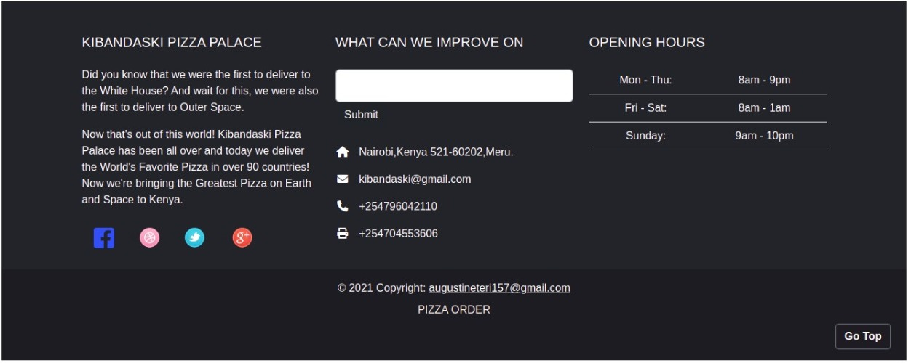

## KIBANDASKI PIZZA PALACE
A website about a pizza restaurant thats stands out to be the best with tasty meals on 14/01/2022.
<strong>By Kubai Augustine Mweteri</strong>

## Description
A web application that shows Kibandaski Pizza Palace what they offer at affordable prices.

## Design

## Setup/Installation Requirements
1)Install the Visual studio code. 2)Git clone the repository. 3)Make sure the live server extension is installed. 4)Click on Go live.

## Todo list
1)Design. 2)Execute for business use.

## Known Bugs
<li>The Website works just fine,there are no bugs.</li>

## Technologies Used
1)HTML.  2)CSS. 3) Javascript. 4)jQuery.

## Support and contact details
Email Address;augustineteri157@gmail.com

## License
Copyright (c) [2022] Kubai Augustine Mweteri.